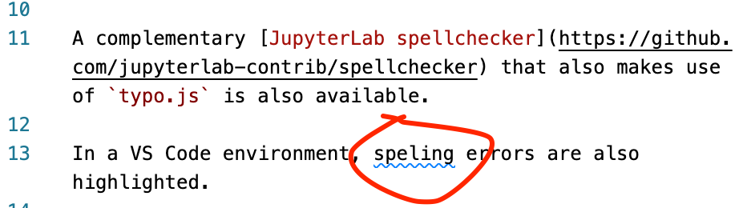
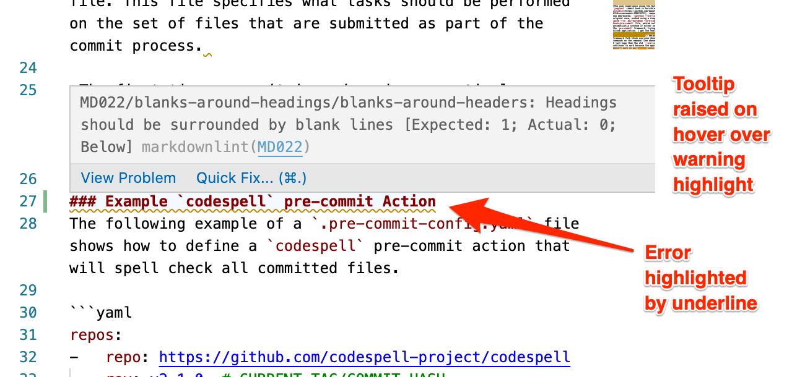
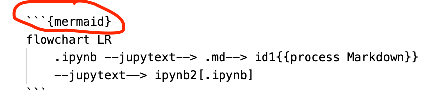

# Editor Automation

Although this may not typically be classed as "automation", it is worth considering how editor tools or extensions can be used to provided "live" automation support doing notebook production or maintenance activity. Live support is available for spellchecking and linting Markdown text, formatting and linting code, and previewing generated content, for example.

## Spellchecking Markdown Text

In the classic notebook environment, the [spellchecker extension](https://jupyter-contrib-nbextensions.readthedocs.io/en/latest/nbextensions/spellchecker/README.html) provides live highlighting of spelling errors identified using the [`typo.js`](https://github.com/cfinke/Typo.js) package.


A complementary [JupyterLab spellchecker](https://github.com/jupyterlab-contrib/spellchecker) that also makes use of `typo.js` is also available.

In a VS Code environment, spelling errors can be highlighted as you type using extensions such as [`valentjn.vscode-ltex`](https://marketplace.visualstudio.com/items?itemName=valentjn.vscode-ltex) grammar/spell checking extension.



## Formatting Code

Code formatting is available in classic notebooks via the [`code_prettify`](https://github.com/ipython-contrib/jupyter_contrib_nbextensions/tree/master/src/jupyter_contrib_nbextensions/nbextensions/code_prettify) extension which provides toolbar buttons for updating the style of a selected code cell, or all code cells in a notebook, using `yapf` or `autopep8`.


The same extension can be extended to support `black` formatting.

For a corresponding JupyterLab extension, see [`ryantam626/jupyterlab_code_formatter`](https://github.com/ryantam626/jupyterlab_code_formatter).

In the VS Code editor, the Python extension [supports code formatting](https://code.visualstudio.com/docs/python/editing#_formatting) using `autopep8`, `black` or `yapf`.

## Linting Markdown and Code

The [`mattijn/pycodestyle_magic`](https://github.com/mattijn/pycodestyle_magic) classic notebook extension can be configured to apply `flake8` style linting to the contents of code cells when they are run.


Contraventions of style rules are highlighted as code cell stream output. The linting is enabled in a notebook using IPython line magic.

In the VS Code editor, the Python extension [natively supports linting](https://code.visualstudio.com/docs/python/linting) using `pylint`.

The VS Code editor also supports the [`DavidAnson.vscode-markdownlint` extension](https://marketplace.visualstudio.com/items?itemName=DavidAnson.vscode-markdownlint) which highlights rule contraventions with the editor.



## Generated Diagram Previews

In publishing workflows based around Sphinx, such as Jupyter Book, several extensions are available that can generate diagrams from a simple Markdown friendly script.

For example, the [`mgaitan/sphinxcontrib-mermaid`](https://github.com/mgaitan/sphinxcontrib-mermaid) and the [`bavovanachte/sphinx-wavedrom`](https://github.com/bavovanachte/sphinx-wavedrom) contributed Sphinx extensions are capable of rendering [Mermaid](https://mermaid-js.github.io/mermaid/#/) and [wavedrom](https://wavedrom.com/tutorial.html) scripted diagrams respectively from scripts wrapped in MyST styled code fenced blocks.



With a slight change to the syntax when labeling the code fenced block, the [`shd101wyy.markdown-preview-enhanced`](https://marketplace.visualstudio.com/items?itemName=shd101wyy.markdown-preview-enhanced) can preview the rendered diagram in the VS Code Markdown preview window.


```{warning}
An [issue](https://github.com/shd101wyy/markdown-preview-enhanced/issues/1626) has been raised to see whether the MyST style label could be supported by the extension.
```

It is also possible to [create some simple block cell magics](https://blog.ouseful.info/2021/09/30/a-simple-pattern-for-embedding-third-party-javascript-generated-graphics-in-jupyter-notebools/) that can be used render diagrams from appropriate diagram script in a classic Jupyter notebook.


```{note}
While a transformation script does not currently exist to support this, it should be eay enough to create a trasnformer that will map between magicked diagram generating code cells and appropriately labeled code fenced blocks to allow for generating and previewing diagrams in a Jupyer notebook user interface and then rendering via a Sphinx publication workflow, or editing and previewing the diagrams via a Markdown source file in VS Code and then generating a corresponding notebook file that utlises block cell magics.
```
