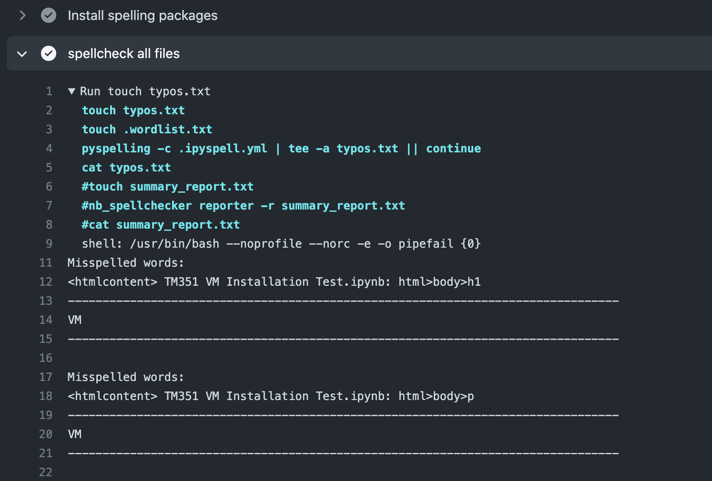
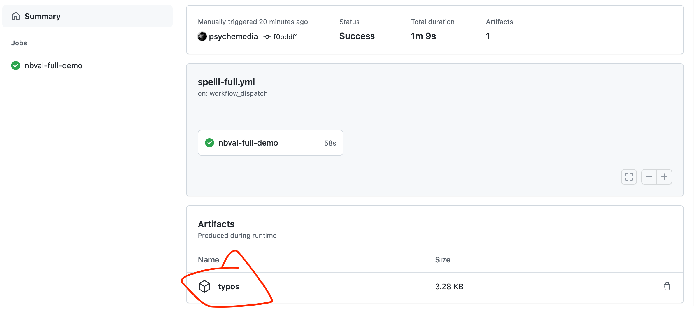
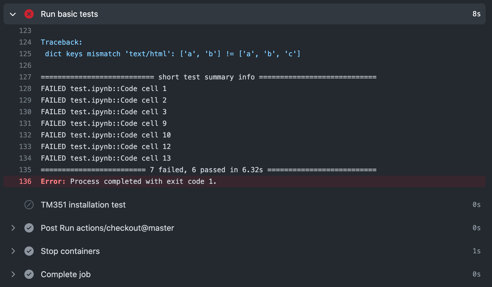

# GitHub Actions

[*GitHub Actions*](https://docs.github.com/en/actions) are automation scripts that can be configured to run in response to triggered events in online GitHub repositories.

A wide range of triggering events are available, including manual triggering, push and pull requests, releases, issue related events, and schedule based `cron` triggers.

whilst actions can be constructed from scratch, a wide range of predefined, and free, third party actions are available on the [GitHub Marketplace](https://github.com/marketplace?type=actions). These can be combined with your own action scripts or commands to define an automated workflow.

For example, an off-the-shelf action might be used to identify whether files of a particular type have been modified in a particular push or pull request, before deciding whether to run the rest of the action. This can be useful if you want to limit an action to only run if `.ipynb` notebook documents have been recently modified.

In this section, we will review how GitHub Actions as part of a notebook quality process, as well as part of an automated notebook release process. A variety of examples will demonstrate:

- how to manually trigger an action;
- how to define an action to run inside a pre-defined, Docker containerised environment;
- how to trigger actions against push event and pull requests;
- how to run commands only over changed files.

In terms of automated behaviours, this section will cover:

- automated spell-checking;
- automated notebook testing using `nbval`;
- automated notebook and markdown paired document synchronisation using `jupytext`.

## Manually Triggering Spell-Checking Actions and Generating Downloadable Action Artefacts

Let's start with a simple example of a [manually triggered action](https://github.blog/changelog/2020-07-06-github-actions-manual-triggers-with-workflow_dispatch/).

Such an action might be used to trigger a spell checker, for example, that is run over all files, or a specified collection of files, in a repository

In the following example, the action can be started from the *Actions* page of a GitHub repository by a user with appropriate permissions on the repository.

```yaml
name: spelling-full-test

# First we define the Action trigger
on:
  # In this case, we define a manual trigger (workflow_dispatch)
  workflow_dispatch

# Define one or more jobs to run via the action
jobs:

  # Set a job name
  spelling-full-demo:

    # Define the base os that will run the action
    runs-on: ubuntu-latest

    # The job will include one or more steps
    steps:

    # We need to get some files to work on...
    # Start by checking out the master branch of the repository
    - uses: actions/checkout@master

    # The spelling checker requires some particular packages
    - name: Install spelling packages
    # Run a set of shell commands to install required packages
      run: |
        sudo apt-get update && sudo apt-get install -y aspell aspell-en

        # The following fork of pyspelling supports notebook md and code cell filters
        python3 -m pip install --upgrade https://github.com/ouseful-PR/pyspelling/archive/th-ipynb.zip

    # Spell check the files
    - name: spellcheck all files
      # Note that we can force the use of a particular shell if required
      run: |
        touch typos.txt
        touch .wordlist.txt
        # The spellchecker typically displays to stdout
        # which is visible in the action run history view
        # The ipyspell.yml file defines the target file paths that the
        # spellchecker is applied to
        # We can also force spellchecker output into a file
        pyspelling -c .ipyspell.yml | tee -a typos.txt || continue
        # Display the file contents
        cat typos.txt
      shell: bash
      # We could let the action fail on errors
      # If we want that halting behaviour, comment out the following line
      continue-on-error: true

    # Saving the spellchecker output to a file then displaying it,
    # rather than just displaying it,  may seem redundant
    # But we can upload the generated file to the Action report page
    # and make it available for download...
    - name: Upload all typos
      uses: actions/upload-artifact@v2
      with:
        name: typos
        path: |
         typos.txt
```

We can follow the progress of the GitHub Action as the various jobs and steps are run:


The Action report status page maintains a log of outputs generated as the action runs. We can use this to review the output report:



Since this particular also generated and uploaded an Action artefact – a zip file containing the spelling report - we can access that asset and download a copy of the report to work with offline.



## Checking Notebook Execution Against a Particular Containerised Environment

We can use the `nbval` package to check the cell outputs of one or more notebooks against an already run reference copy of each tested notebook. *This allows us to check that environment updates have not jeopardised the intended notebook execution, for example.*

Typically, the notebooks might be designed to work within a particular environment. We could use requirements style files to specify a list of packages that need to be installed, or we can set up the action to against a particular containerised environment.

The following GitHub Action definition script shows how we can test the execution of a set of notebooks against a pre-built Docker container, such as a container created to support a particular student module.

```yaml
name: nbval-example

on:
  # Use a manual trigger
  workflow_dispatch

jobs:

  nbval-demo:
    runs-on: ubuntu-latest

    # Specify we want to run the tests inside a particular containerised environment
    container:
      image: ouvocl/vce-tm351-monolith

    # Define the action steps
    steps:

    # Checkout the desired branch
    - uses: actions/checkout@master

    # Install any additional requirements into the environment
    - name: Install nbval (TH edition)
      run: |
        python3 -m pip install --upgrade https://github.com/ouseful-PR/nbval/archive/table-test.zip

    # Ensure that required services are running
    - name: Restart postgres
      run: |
        sudo service postgresql restart

    # Explicitly start an application required for testing
    - name: Start mongo
      run: |
        # The environment variable is already defined in the container
        sudo mongod --fork --logpath /dev/stdout --dbpath ${MONGO_DB_PATH}

    # Run an installation test notebook
    - name: TM351 installation test
      run: |
        py.test --nbval TM351*.ipynb
      # The following line means that the action will continue
      # rather than fail if this step fails
      continue-on-error: true
```

The action report shows each step has completed, as well as how long each step took to complete. We can see in this case that the installation test notebook cells all passed correctly.


If we have a test that fails, but have qualified a step with `continue-on-error: true`, we can review the failed tests without breaking the flow of the action:


We can further see the step generated an error code, but that was trapped by the `continue-on-error: true` setting and the action continued:


If remove the `continue-on-error` setting, or set `continue-on-error: false` (the default), the action would have failed:


If we check the report, we see the failure was blocking and prevented execution of the next step. However, certain other (housekeeping) steps that are defined to always run did execute.



## Triggering Actions Based on the Presence of Particular Modified File Types

The [`dorny/paths-filter`](https://github.com/dorny/paths-filter) GitHub Action *"enables conditional execution of workflow steps and jobs, based on the files modified by pull request, on a feature branch, or by the recently pushed commits."*.

```yaml
name: nbval-partial-test

# Trigger the action from a push event
on:
  pull

jobs:
  # Check that files of a particular type have changed
  changed-filetype-filter:
    runs-on: ubuntu-latest

    # Define action steps
    steps:

    # Checkout
    - uses: actions/checkout@v2

    # Check that particular file types have been changed
    - uses: dorny/paths-filter@v2
      id: changes
      with:
        filters: |
        src:
            - 'src/**'

    # Only run if some file in 'src' folder was changed
    - if: steps.changes.outputs.src == 'true'
    run: |
    # These steps will only run if notebooks changed
    echo "At least one .ipynb doc on src/ path was changed"
```

We can also use the action in association with other jobs, creating the guard in one job and then referencing it in another.

```yaml
name: notebook-checking

on:
  pull

jobs:
  changes:
    runs-on: ubuntu-latest
    # Set job outputs to values from filter step
    outputs:
      notebooks: ${{ steps.filter.outputs.notebooks }}
    steps:
    # In a PR, we do not need to set the fetch-depth
    - uses: actions/checkout@v2
    - uses: dorny/paths-filter@v2
      id: filter
      with:
        filters: |
          notebooks:
            - added|modified:  '**.ipynb'

  # This job will run if there were changed notebooks
  job-for-notebooks:
    needs: changes
    if: ${{ needs.changes.outputs.notebooks == 'true' }}
    runs-on: ubuntu-latest
    steps:
    #...
```

## Running Commands Against Changed Files

As well as allowing us to create a guard that checks whether files of a particular type have been modified, the [`dorny/paths-filter`](https://github.com/dorny/paths-filter) action can also pass the names of changed files, allowing us to act on them directly:

```yaml
name: process-changes-md

on:
  push

jobs:
  changes-spellcheck:
    runs-on: ubuntu-latest
    steps:

    # Checkout
    - uses: actions/checkout@v2

    # Test for markdown files
    - uses: dorny/paths-filter@v2
      id: filter
      with:
        # Enable listing of files matching each filter.
        # Paths to files will be available in `${FILTER_NAME}_files` output variable.
        # Paths will be escaped and space-delimited.
        # Output is usable as command-line argument list in Linux shell
        list-files: shell

        # In this example changed markdown will be spellchecked using aspell
        # If we specify we are only interested in added or modified files, deleted files are ignored
        filters: |
          notebooks:
            - added|modified: '**.md'

    - name: Install packages if changed files
      if: ${{ steps.filter.outputs.notebooks == 'true' }}
      run: |
        sudo apt-get update && sudo apt-get install -y aspell aspell-en
        pip install codespell

    - name: Process changed files
      if: ${{ steps.filter.outputs.notebooks == 'true' }}
      run: |
        # If a command accepts a list of files,
        # we can pass them directly
        # This will cause the action to error if there is a typo
        codespell ${{ steps.filter.outputs.notebooks_files }}

        # Alternatively, we might iterate over files one at a time
        # If we had comma separated files, we could specify separator
        #IFS=","
        # Generate an array of the modified file names
        read -a added_modified_files <<< "${{ steps.filter.outputs.notebooks_files }}"
        # Then iterate over each filename
        for added_modified_file in "${added_modified_files[@]}"; do
          # The || continue statement will ensure that
          # even with errors, the action continues
          codespell "$added_modified_file" || continue
        done
      shell: bash
```

## Synchronising Markdown and Notebook Files Using `jupytext`

An editor making amends directly to a markdown text document that is intended to be paired with `.ipynb` notebook file may well make such changes in an arbitrary text editing environment. Since such an editor is likely to be operating outside the context of a Jupyter server process running the `jupytext` server extension, it is quite likely that the text and `.ipynb` versions will be out of synch. *(The use of GitHub pre-commit actions could help keep files in synch at the commit level for editors working under local git version control.)*

We can define an action that will attempt to synchronise changed markdown files if they form part of a push or pull request. Specifically, if a markdown file is added or deleted, *and* if it contains `jupytext` pairing metadata, we can ensure that any other paired documents are synchronised. (If a changed markdown document is *not* recognised by `jupytext` as a paired document, it will not be synchronised.)

Using the [`stefanzweifel/git-auto-commit-action`](https://github.com/stefanzweifel/git-auto-commit-action), we can then automatically commit any paired notebook files that that are updated as a result of the synchronisation.

```yaml
name: jupytext-changes

on:
  push

jobs:
  sync-jupytext:
    runs-on: ubuntu-latest
    steps:

    # Checkout
    - uses: actions/checkout@v2

    # Test for markdown
    - uses: dorny/paths-filter@v2
      id: filter
      with:
        # Enable listing of files matching each filter.
        # Paths to files will be available in `${FILTER_NAME}_files` output variable.
        # Paths will be escaped and space-delimited.
        # Output is usable as command-line argument list in Linux shell
        list-files: shell

        # In this example changed markdown will be spellchecked using aspell
        # If we specify we are only interested in added or modified files, deleted files are ignored
        filters: |
            notebooks:
                - added|modified: '**.md'
        # Should we also identify deleted md files
        # and then try to identify (and delete) .ipynb docs otherwise paired to them?
        # For example, remove .ipynb file on same path ($FILEPATH is a file with .md suffix)
        # rm ${FILEPATH%.md}.ipynb

    - name: Install Packages if changed files
      if: ${{ steps.filter.outputs.notebooks == 'true' }}
      run: |
        pip install jupytext

    - name: Synch changed files
      if: ${{ steps.filter.outputs.notebooks == 'true' }}
      run: |
        # If a command accepts a list of files,
        # we can pass them directly
        # This will only synch files if the md doc include jupytext metadata
        # and has one or more paired docs defined
        # The timestamp on the synched ipynb file will be set to the
        # same time as the changed markdown file
        jupytext --use-source-timestamp  --sync ${{ steps.filter.outputs.notebooks_files }}

    # Auto commit any updated notebook files
    - uses: stefanzweifel/git-auto-commit-action@v4
      with:
        # This would be more useful if the git hash were referenced?
        commit_message: Jupytext synch - modified, paired .md files
````

Note that as it currently stands, the action *will not* update notebook output cells, which means that if the content of any code cells in the markdown document are modified, the notebook cell outputs may no longer represent a true output from the modified code cells.

It would be possible to run the `jupytext` action with an `--execute` switch, although the step would need to be run in an environmental context configured to supporting the execution of the notebook(s).

## Using GitHub Actions to Process OU-XML Documents

As well as processing notebooks and text documents, we can use GitHub Actions to automate quality checks against OU-XML source documents.

The process actually makes use of a crude document conversion from OU-XML to MyST flavoured extended markdown.
