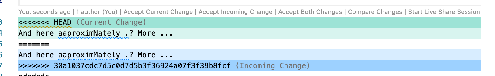

# `git` and GitHub Based Workflows

One of the advantages of working under a `git` managed workflow is that it is designed to support *collaborative* working using local copies of documents that can be compared and referenced back to a central `main` copy of the document (this was original referred to as the `master` version, but the default language has moved on).

This means that it is possible for different people to work on the same document at the same time, albeit with some caveats: if an author "hands" over document to an editor by checking it into the repository and flagging it as "ready for editing", and the editor then checks it out, what happens if the author suddenly spots a change they want to make, or spots an error they can fix?

In a waterfall process, once the document has been handed over, relay baton style, the author is not allowed, indeed, is not able to, make changes to the copy handed over to the editor. Even if the editor is not in a position to work on the document for a week. Or two. Or three. Or four.

Under the collaborative repository model, the author can check out the latest copy of the material, make the correction and then check it back in. It is important to note that the only thing the author actually checks back in is a "delta", essentially a change note that identifies what they want to change in the document. Along with this, they may submit a "commit message", a brief text description to summarise the change they made.

The editor can merge in any changes made to the central repository into their own working copy at any time: the commit messages summarise the change, and the actual change can be reviewed by the editor.

This way of working allows the author to continue to make changes to the material, even as the editor works on their copy.

This is fine as the author makes changes to material that the editor has not yet started editing. But what happens if the author submits a change to material the editor has already reviewed?

```{note}
No disrespect or offence is intended in the following discussion. The roles of `author` and `editor` are, if anything, caricatures of two extreme positions being ridiculed to make a particular point.
```

Consider the following two cases:

- the author changes material the editor *has not* changed in their own local copy;
- the author changes material the editor *has* changed in their own local copy.

In the first case, we then need to ask: *does the change have forward or backward echoes?* If the author spotted a typo missed by the editor, and fixed it, there are probably no side effects arising from the change. But if the author makes a claim ("in the previous section, we saw..."), then the editor may need to do some work (e.g. checking that claim). It might also be that the author sets up a situation that the editor needs to check for consistency around in later sections which might already have been edited.

In the second case, where the author has made a change to text that the editor has also changed, it might be that the author made the same change, in which case it can be accepted by the editor and their change is essentially negated.

On the other hand, the author may have made a change that conflicts with the editor's change. We might now have a heated debate about whether the author should be "allowed" to make changes to "their" material before they have had the benefit of seeing *all* the editor's suggested changes to the original copy (even though the author may already have ripped up a large part of that material in disgust). Or we might argue that the editor should be working with the author's current best attempt at the material and should set to work either accepting the author's amendment, or factoring it in to the editor's suggested change.

## Fixing Merge Conflicts

At this point, it is worth noting that there is likely to be a "training" issue here. Fixing conflicts can be a faff. But it's simplified using support tools such as the VS Code or Atom editors.

For example, suppose we have a warning about a merge conflict that has arisen because the editor has committed a change to their local working copy that conflicts with a change the author has pushed to the central repository and that the editor is trying to merge in to bring their materials up to date with the author's latest committed version.


*The default editor can be set in the GitHub Desktop App from the application `Preferences` menu.*

Opening the conflicted elements in the browser shows the editor's locally committed version and the author's conflicting update. The editor can use the menu bar controls wrapping the highlighted conflict to accept one or other (or both) of the changes. Alternatively, the editor can directly edit one of the suggests and then accept that (now edited) suggestion.



Accepting one of the changes then resolves the conflict:


## Who's the Boss?

To a certain extent, who controls the files in the central repository might be thought of as having the upper hand. If the author keeps committing changes to the main repository, and the editor is working on their own local copies of the files, they might soon start to resent a continual stream of changes being uploaded by the author to the central repository that the editor then has to reconcile with their own updates that the author may not be aware of.

But there is nothing to stop the editor creating their own *branch* on the central repository and committing changes to it as they make them. It is quite possible for the author to keep themselves up to date with changes being made by the editor by merging the editor's changes into the author's own working copy:


What this means is that the author and the editor can continually share updates on a regular basis, rather than have to schedule large waterfall style handovers where large amounts of change are communicated at once.

In addition, the author and the editor can also review each other's work in progress *without* having to directly merge in changes into their own branch: they can simply switch to the other's branch and review the commit notices and changes made.

Whilst this may have the feeling of one person peering over the shoulder of the other, it does mean that one person can say early on *"ah, I see you have an issue with X; that repeats throughout; shall we discuss it now and come to a resolution and either I can fix it by this particular means, or you can continue to make that sort of change"*.

## Partial Adoption Considered Harmful

The `git` workflow supports collaborative working. However, if `git` tools are used in a naive way to "support" traditional waterfall style ways of working, *bad things* can happen.

For example, suppose that an editor is not working in a `git` controlled workflow. They *download* a "handover" bundle of files from a GitHub repository and work on them locally. In the meantime, other collaborators on the repository are spotting and fixing issues as they come across them.

The editor works and works and works and works and then uploads all their amended files to the main branch of the repository, obliterating all the changes that the other collaborators have been feeding in even as the editor worked in blissful solitude. __This would not be a good outcome.__

Or suppose that the editor and the author both struggle with the idea of collaborative editing: the author just keeps uploading changes as they occur to them to the main branch of the repository without any meaningful commit messages. The editor puts all their changed files into a branch in a single commit and then makes a pull request (PR, for short) onto the main branch.

This PR raises hundreds of merge conflict messages. So who will fix them? Whose problem is it anyway?

At this point, it's worth recalling that dealing with merge conflicts can be fiddly. So if there is a training issue, who should be the one trained to address the merge conflicts?

In a *Track Changes* Microsoft Word workflow, we might expect the author to be the one reconciling the conflicts, for example as they merge changes from critical readers as well as an editor into their own working reference document, for example.

But if we follow the semantics of the PR, a pull *request*, it is presumably down to the editor to ensure that their changes are well-behaved and respectful of the content in the main repository that the editor is *requesting* the merging of changes into. Which means that updates from main should really be merged into the PR by the owner of the PR (which is to say, the editor) *before* the PR is accepted.

```{note}
In part, this raises the question of who the owner of the main branch is and who is allowed to accept changes to it.

In the above example, I have given the author primacy of control, with the editor working in a supporting role to them. At the end of the day, the author is the one who needs to defend or justify their words, and who is responsible for them.

However, a more pertinent question might be: what is the most acceptable way to manage change, *and who decides*? In a waterfall process, the linear process with discrete handovers introduces delays and waste (e.g. in the sense of lean production): for large amounts of time, work that could be being done is prevented from being done whilst waiting for other irrelevant work to be completed.
```

In this case, it is perhaps in the interest of the editor to try to keep up to date with changes at some early step in the process, for example, regularly merging in changes from main even as they do their editing.

This also allows the author to contribute improvements and corrections to the material even as the editor works on them.
